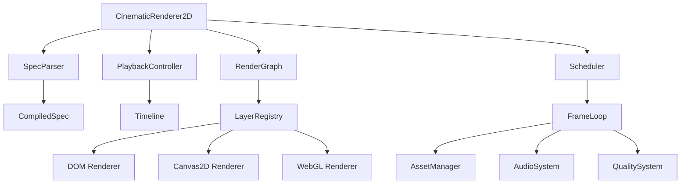

# Design Document: cinematicRenderer2D

## Overview

The cinematicRenderer2D is a high-performance, framework-agnostic TypeScript library that renders cinematic experiences from JSON specifications. The architecture prioritizes performance through optimized rendering backends, precompiled animation tracks, and adaptive quality systems to achieve 60-120fps across devices.

The library follows a modular architecture with clear separation between parsing, rendering, animation, and asset management. Multiple rendering backends (DOM, Canvas2D, future WebGL) handle different content types optimally, while a plugin system allows extensible layer types.

## Architecture

### Core Architecture Pattern

The system uses a **Composition-based Entity-Component-System (ECS)** pattern where:
- **Entities**: Scenes and Events
- **Components**: Layers with specific rendering behaviors  
- **Systems**: Rendering backends, animation system, audio system



### Performance-First Design Principles

1. **Zero-allocation Animation Loop**: All objects pre-allocated during compilation
2. **GPU-accelerated Transforms**: Only animate transform, opacity, and minimal filters
3. **Batched Rendering**: Group similar operations to minimize state changes
4. **Adaptive Quality**: Dynamic performance monitoring with automatic degradation
5. **Memory Pooling**: Reuse particle and temporary objects

## Components and Interfaces

### Core Engine Interface

```typescript
interface ICinematicRenderer2D {
  // Lifecycle
  mount(): Promise<void>;
  play(): void;
  pause(): void;
  stop(): void;
  destroy(): void;
  
  // Navigation
  seek(timeMs: number): void;
  goToEvent(eventId: string): void;
  goToScene(sceneId: string): void;
  
  // Configuration
  setQuality(level: QualityLevel): void;
  resize(width: number, height: number): void;
  
  // Events
  on(event: string, callback: Function): void;
  off(event: string, callback: Function): void;
}
```

### Layer Plugin System

```typescript
interface ICinematicLayer {
  id: string;
  type: string;
  zIndex: number;
  
  mount(ctx: LayerMountContext): void;
  update(ctx: FrameContext): void;
  destroy(): void;
}

interface LayerMountContext {
  container: HTMLElement;
  canvas?: HTMLCanvasElement;
  renderer: RenderBackend;
  assetManager: AssetManager;
}

interface FrameContext {
  timeMs: number;
  deltaMs: number;
  quality: QualityLevel;
  viewport: { width: number; height: number };
}
```

### Animation System Interface

```typescript
interface CompiledAnimationTrack {
  property: string;
  startMs: number;
  endMs: number;
  interpolate: (progress: number) => any;
  loop?: boolean;
  yoyo?: boolean;
}

interface AnimationCompiler {
  compileTrack(track: AnimationTrackSpec): CompiledAnimationTrack;
  compileEasing(easing: string): (t: number) => number;
}
```

## Data Models

### JSON Specification Schema

```typescript
interface CinematicSpec {
  schemaVersion: string;
  engine: {
    targetFps?: number;
    quality?: QualityLevel;
    debug?: boolean;
  };
  events: CinematicEvent[];
  scenes: CinematicScene[];
  assets?: AssetDefinition[];
}

interface CinematicEvent {
  id: string;
  name: string;
  scenes: string[]; // scene IDs
  transitions?: TransitionSpec[];
}

interface CinematicScene {
  id: string;
  name: string;
  duration: number;
  layers: LayerSpec[];
  audio?: AudioTrackSpec[];
}

interface LayerSpec {
  id: string;
  type: string;
  zIndex: number;
  config: Record<string, any>;
  animations?: AnimationTrackSpec[];
}

interface AnimationTrackSpec {
  property: string;
  from: any;
  to: any;
  startMs: number;
  endMs: number;
  easing?: string;
  loop?: boolean;
  yoyo?: boolean;
}
```

### Compiled Runtime Models

```typescript
interface CompiledSpec {
  events: Map<string, CompiledEvent>;
  scenes: Map<string, CompiledScene>;
  assets: Map<string, Asset>;
  globalConfig: EngineConfig;
}

interface CompiledScene {
  id: string;
  duration: number;
  layers: CompiledLayer[];
  audioTracks: CompiledAudioTrack[];
}

interface CompiledLayer {
  id: string;
  type: string;
  zIndex: number;
  instance: ICinematicLayer;
  animations: CompiledAnimationTrack[];
}
```

## Correctness Properties

*A property is a characteristic or behavior that should hold true across all valid executions of a system-essentially, a formal statement about what the system should do. Properties serve as the bridge between human-readable specifications and machine-verifiable correctness guarantees.*

Based on the prework analysis, here are the key correctness properties:

**Property 1: Constructor Acceptance**
*For any* valid DOM element and valid JSON specification, the CinematicRenderer2D constructor should successfully initialize without throwing errors
**Validates: Requirements 1.1**

**Property 2: Navigation Consistency**
*For any* valid time value, seeking to that time should update the current time to match the requested time
**Validates: Requirements 1.3**

**Property 3: Event Emission Reliability**
*For any* playback state change (play, pause, stop), the corresponding event should be emitted to all registered listeners
**Validates: Requirements 1.4**

**Property 4: Responsive Resize Behavior**
*For any* container dimension change, the renderer should automatically trigger a resize operation
**Validates: Requirements 1.5**

**Property 5: Performance-Optimized Property Updates**
*For any* animation update, only transform, opacity, and minimal filter CSS properties should be modified
**Validates: Requirements 2.3**

**Property 6: DOM Node Creation Constraint**
*For any* update cycle after initial mount, no new DOM nodes should be created
**Validates: Requirements 2.4**

**Property 7: Animation Compilation Timing**
*For any* animation track, compilation to optimized functions should occur during parsing phase, not during update cycles
**Validates: Requirements 2.6, 3.3, 6.5**

**Property 8: JSON Validation Correctness**
*For any* JSON specification, valid specs should be accepted and invalid specs should be rejected with descriptive error messages
**Validates: Requirements 3.1, 3.4**

**Property 9: Default Value Application**
*For any* JSON specification with missing optional properties, default values should be applied consistently
**Validates: Requirements 3.2**

**Property 10: Schema Version Compatibility**
*For any* supported schema version, the parser should handle the specification according to that version's rules
**Validates: Requirements 3.5**

**Property 11: Rendering Backend Property Usage**
*For any* DOM layer type (text, image, gradient, overlay), the rendered elements should use CSS transforms and will-change properties
**Validates: Requirements 4.1, 4.3**

**Property 12: Canvas Pixel Ratio Scaling**
*For any* canvas layer, the canvas dimensions should account for devicePixelRatio scaling
**Validates: Requirements 4.2**

**Property 13: Particle Object Pooling**
*For any* particle system, increasing particle count should not cause new object allocations beyond the initial pool
**Validates: Requirements 4.4**

**Property 14: Layer Plugin Registration**
*For any* custom layer type registration, the layer should become available for use in specifications
**Validates: Requirements 5.1**

**Property 15: Layer Z-Index Ordering**
*For any* set of layers with different zIndex values, layers should render in ascending zIndex order
**Validates: Requirements 5.5**

**Property 16: Animation Track Property Support**
*For any* animation track targeting opacity, transform, or blur properties, the track should be created and executed successfully
**Validates: Requirements 6.1, 6.2**

**Property 17: Animation Feature Completeness**
*For any* animation with easing, loop, or yoyo configuration, the animation should execute with the specified behavior
**Validates: Requirements 6.3**

**Property 18: Animation Interpolation Smoothness**
*For any* animation track, values should interpolate smoothly between keyframes over the specified time range
**Validates: Requirements 6.4**

**Property 19: Audio Feature Support**
*For any* audio track with fade or volume configuration, the audio should play with the specified effects
**Validates: Requirements 7.2**

**Property 20: Audio Error Resilience**
*For any* autoplay restriction or audio loading failure, the system should continue operating without crashing
**Validates: Requirements 7.3, 7.4**

**Property 21: Audio-Visual Synchronization**
*For any* audio track with timing specifications, audio playback should synchronize with the visual timeline
**Validates: Requirements 7.5**

**Property 22: Quality System Monitoring**
*For any* auto quality mode activation, FPS monitoring should occur at 1-2 second intervals
**Validates: Requirements 8.2**

**Property 23: Adaptive Quality Response**
*For any* FPS drop below threshold, the quality system should reduce particle count and resolution
**Validates: Requirements 8.3**

**Property 24: Device Capability Respect**
*For any* device with prefers-reduced-motion, low memory, or power saving mode, quality settings should be adjusted accordingly
**Validates: Requirements 8.4**

**Property 25: Quality Override Control**
*For any* manual quality level setting, the system should override auto mode and maintain the specified quality
**Validates: Requirements 8.5**

**Property 26: Comprehensive Asset Management**
*For any* asset (image, video, audio), the asset should be preloaded, cached, and loading failures should be handled gracefully
**Validates: Requirements 9.1, 9.2, 9.4**

**Property 27: Asset Loading Progress**
*For any* asset loading operation, progress events should be emitted throughout the loading process
**Validates: Requirements 9.3**

**Property 28: Framework Adapter Delegation**
*For any* framework adapter operation, the adapter should delegate to the core engine without duplicating functionality
**Validates: Requirements 10.3, 10.4, 10.5**

**Property 29: Debug Information Availability**
*For any* debug mode activation, FPS counter, current event/scene/time, and active layers should be displayed
**Validates: Requirements 11.3**

**Property 30: CLI Validation Functionality**
*For any* JSON specification provided to the CLI, validation should return appropriate success or error results
**Validates: Requirements 11.5**

**Property 31: Build Output Compliance**
*For any* build operation, the output should include ESM and CJS formats with proper tree-shaking support and semantic versioning
**Validates: Requirements 12.1, 12.3**

<function_calls>
<invoke name="prework">
<parameter name="featureName">cinematic-renderer2d

## Error Handling

### Graceful Degradation Strategy

The system implements a multi-layered error handling approach:

1. **Specification Validation**: Comprehensive JSON schema validation with detailed error messages
2. **Asset Loading Fallbacks**: Automatic fallback to default assets when loading fails
3. **Rendering Backend Fallbacks**: Graceful degradation from WebGL → Canvas2D → DOM
4. **Audio Autoplay Handling**: Silent failure with user interaction prompts
5. **Performance Degradation**: Automatic quality reduction when performance targets aren't met

### Error Recovery Mechanisms

```typescript
interface ErrorRecoveryStrategy {
  // Asset loading failures
  onAssetLoadError(assetId: string, error: Error): Asset | null;
  
  // Rendering failures
  onRenderError(layerId: string, error: Error): boolean; // continue rendering?
  
  // Audio failures
  onAudioError(trackId: string, error: Error): void;
  
  // Performance issues
  onPerformanceIssue(fps: number, targetFps: number): QualityLevel;
}
```

### Critical Error Boundaries

- **Specification Parsing**: Invalid JSON should not crash the engine
- **Layer Rendering**: One layer failure should not affect other layers
- **Asset Loading**: Missing assets should use fallbacks or skip gracefully
- **Animation Compilation**: Invalid animation tracks should be ignored with warnings

## Testing Strategy

### Dual Testing Approach

The testing strategy combines **unit tests** and **property-based tests** for comprehensive coverage:

**Unit Tests Focus:**
- Specific examples demonstrating correct behavior
- Integration points between components (SpecParser → RenderGraph)
- Edge cases and error conditions (invalid JSON, missing assets)
- Framework adapter integration (React/Angular lifecycle)

**Property-Based Tests Focus:**
- Universal properties across all inputs (animation interpolation correctness)
- Performance constraints (DOM node creation limits)
- API contract compliance (event emission reliability)
- Cross-browser compatibility validation

### Property-Based Testing Configuration

**Library Selection**: Use **fast-check** for TypeScript property-based testing
- Minimum 100 iterations per property test
- Custom generators for JSON specifications, DOM elements, and animation tracks
- Shrinking support for minimal failing examples

**Test Tagging Format:**
```typescript
// Feature: cinematic-renderer2d, Property 1: Constructor Acceptance
test('constructor accepts valid inputs', () => {
  fc.assert(fc.property(
    validDOMElementGenerator(),
    validJSONSpecGenerator(),
    (element, spec) => {
      expect(() => new CinematicRenderer2D({ container: element, spec }))
        .not.toThrow();
    }
  ), { numRuns: 100 });
});
```

### Performance Testing Strategy

**Automated Performance Validation:**
- Frame rate monitoring during test execution
- Memory usage tracking for object pooling validation
- Bundle size analysis for tree-shaking verification
- Cross-device testing using browser automation

**Performance Benchmarks:**
- Particle system stress tests (1000+ particles)
- Complex animation scenarios (multiple layers, simultaneous tracks)
- Asset loading performance (large image/video collections)
- Framework integration overhead measurement

### Testing Infrastructure

**Test Environment Setup:**
- Headless browser testing with Playwright
- Canvas rendering validation using pixel comparison
- Audio testing with Web Audio API mocking
- TypeScript type checking in CI/CD pipeline

**Continuous Integration:**
- Automated testing on multiple browsers (Chrome, Firefox, Safari)
- Performance regression detection
- Bundle size monitoring
- Documentation generation and validation